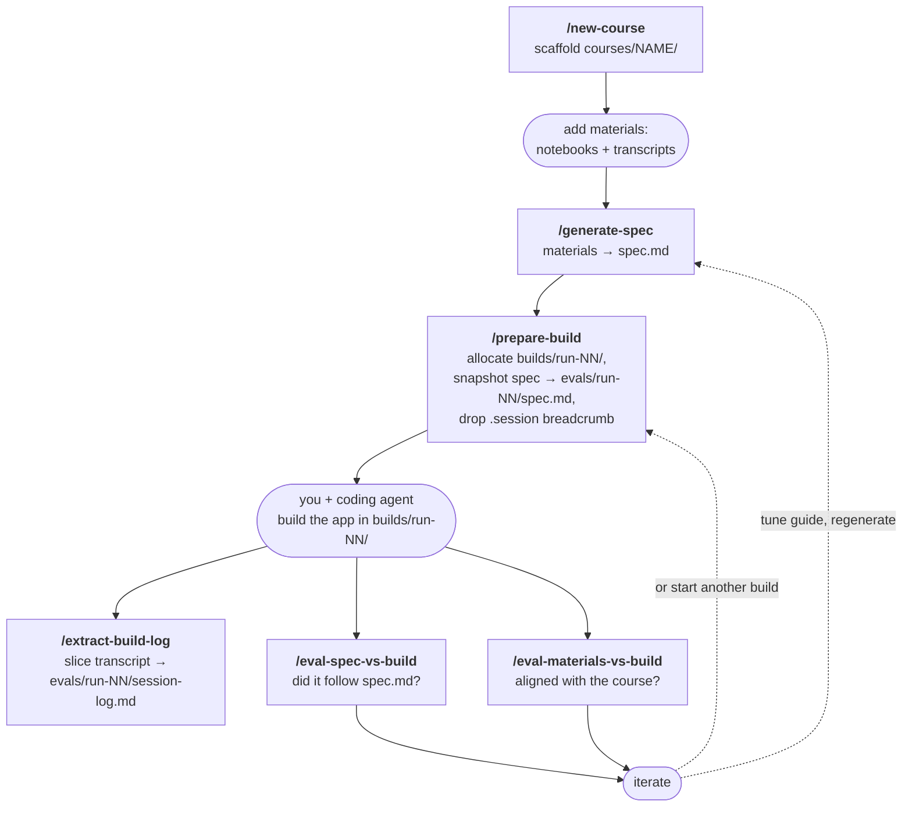

# spec-build-lab

An exploration harness for one idea: **can a course's materials be turned into a
build-ready spec that a learner builds a real app from — and how well does the
result hold up?**

The loop:

```
course materials  →  spec.md  →  build  →  extract  →  eval  →  iterate
   notebooks +        /generate-   /prepare-   /extract-     /eval-spec-vs-build
   transcripts        spec         build       build-log     /eval-materials-vs-build
                                               (slice the
                                               session
                                               transcript)
```

This repo exists to run that loop many times, capture what happens, and judge it
from two angles — so the skills, the spec guide, and the eval criteria are all
expected to change as we learn.

## Structure

```
spec-build-lab/
├── .claude/
│   └── skills/
│       ├── new-course/                # scaffold courses/<name>/ from the template
│       ├── generate-spec/             # materials → spec.md (uses the guide below)
│       │   ├── references/
│       │   │   └── spec-generation-guide.md
│       │   └── scripts/ingest_repo.py # optional: git repo → materials/notebooks/ context dump
│       ├── prepare-build/             # allocate builds/run-NN/ + drop .session breadcrumb (auto-fires on build intent)
│       ├── extract-build-log/         # slice the conversation from the session transcript
│       │   └── scripts/extract.py
│       ├── eval-spec-vs-build/        # did the build follow spec.md?
│       └── eval-materials-vs-build/   # how does the build align with / diverge from the course?
├── templates/
│   └── course/                        # skeleton new-course copies
│       ├── materials/{notebooks,transcripts}/
│       ├── spec.md
│       ├── builds/
│       └── evals/
└── courses/
    └── <course-name>/                 # one per course (created by new-course)
        ├── materials/{notebooks,transcripts}/
        ├── spec.md
        ├── builds/
        │   └── run-NN/                # the built app, ONLY — gitignored here; may have its own git
        └── evals/
            └── run-NN/                # .session · spec.md · session-log.md · spec-vs-build.md · materials-vs-build.md
```

## Where you work (layers & movement)

Launch Claude Code **once, at the repo root**, and stay in that single session
for the whole loop. The root is where the skills and `CLAUDE.md` live. Your
*working directory* moves during the loop, but the *session* stays rooted at
the repo root.

| You're working in… | What happens there | What you run |
|---|---|---|
| repo root | manage courses | `/new-course` |
| `courses/<name>/` | spec + extract + evaluation | `/generate-spec`, `/prepare-build`, `/extract-build-log`, `/eval-spec-vs-build`, `/eval-materials-vs-build` |
| `courses/<name>/builds/run-NN/` | actual app development | the build itself — install deps, run the dev server, optional app-level `git init` |

So `cd courses/<name>/` to work on a course; once a build starts, you and the
agent move down into `builds/run-NN/` to develop; come back up to the course
folder to extract the conversation and evaluate. Stay in one session per build —
the breadcrumb at `evals/run-NN/.session` points at that session's transcript,
which is what `/extract-build-log` slices.

## Lifecycle



A walkthrough — building a RAG app from a `langchain-rag` course, empty repo to
evaluated run:

```text
# 1 · from the repo root: create the course
/new-course langchain-rag                 # -> courses/langchain-rag/

# 2 · add source material by hand
#     Get notebooks + transcripts at https://course-context-lab.vercel.app
#     (manual download — the agent does NOT fetch from the URL).
#     Tip: drag the downloaded files from Finder into the terminal window;
#     that pastes their absolute paths so the agent can `cp` them straight
#     into the course folder. Saves tokens vs. having the agent traverse
#     your filesystem.
#     notebooks   -> courses/langchain-rag/materials/notebooks/
#     transcripts -> courses/langchain-rag/materials/transcripts/
#
#     Notebook shortcut: if the course code lives in a git repo, skip the
#     manual notebook download — pass the repo to /generate-spec in step 3
#     and it ingests the .ipynb files + helper.py for you (see "Ingesting
#     notebooks from a git repo" below). Transcripts still come from the site.

# 3 · move into the course and generate the spec
cd courses/langchain-rag
/generate-spec                            # -> courses/langchain-rag/spec.md
#     …or, with the notebook shortcut:
/generate-spec git@github.com:org/course-repo.git   # ingest, then generate

# 4 · start a build (call it explicitly)
/prepare-build                        # -> builds/run-01/  (the app lives here)
                                          #    snapshots spec.md -> evals/run-01/spec.md
                                          #    drops evals/run-01/.session, moves you into builds/run-01/

# 5 · build the app with your agent — you are now in builds/run-01/
#     "build the RAG app from the spec"  -> install deps, write code, run it...
#     no recorder is running; Claude Code persists the transcript on its own.

# 6 · extract the build conversation when you have something worth capturing
cd ../..                                  # back up to courses/langchain-rag
/extract-build-log run-01                 # -> evals/run-01/session-log.md
                                          #    slices the transcript between
                                          #    the /prepare-build announcement
                                          #    and a fuzzy diagram/structure phrase
                                          #    (or pass --until="<phrase>" to override)

# 7 · evaluate — name the run (no default; you are asked if you omit it)
/eval-spec-vs-build run-01                # -> evals/run-01/spec-vs-build.md
/eval-materials-vs-build run-01           # -> evals/run-01/materials-vs-build.md

# 8 · iterate: tune the guide, then start another build
/prepare-build                        # -> builds/run-02/, evals/run-02/spec.md, ...
```

## Ingesting notebooks from a git repo

`/generate-spec` optionally takes a git repo as its argument. When given one, it
runs a deterministic ingest step **before** reading materials:

```text
/generate-spec <repo>                     # e.g. git@github.com:org/course-repo.git
```

What it does, exactly (`generate-spec/scripts/ingest_repo.py`, stdlib-only):

1. **Clones the repo** shallowly using your own git credentials — so a private
   repo works as long as *you* can reach it. Accepted forms:
   - **SSH** — `git@github.com:org/repo.git` or `ssh://…` (uses your SSH key)
   - **HTTPS** — `https://github.com/org/repo.git`
   - **Local path** — an existing directory or `file://` URL is copied, not
     cloned (handy for testing or repos you already have on disk)
   A `--ref <branch|tag|sha>` can pin what gets ingested.
2. **Renders every `.ipynb`** in the repo cell-by-cell into a single markdown
   file at `materials/notebooks/<course>-context.md` — the same shape as a
   hand-downloaded course context dump.
3. **Appends a de-duplicated "Helper Module Context" section** from the repo's
   `helper.py` module(s): each unique top-level def/class appears once,
   identical copies (including symlinks) collapse, and a same-name-but-
   different-body collision keeps both variants flagged inline — nothing is
   silently dropped.

Scope guarantees: the script writes **only** into `materials/notebooks/`;
`materials/transcripts/` is never touched and remains a manual download from
the course site. Lesson numbering in the output is inferred from sorted
notebook order — a convenience label, not authentic platform numbering (the
transcripts stay authoritative for that). The ingest is idempotent: re-running
overwrites the context file cleanly. Without a repo argument, `/generate-spec`
behaves as before and uses whatever is already in `materials/`.

`/prepare-build` is the expected, explicit step — it will also fire on its own
if you simply start building, but the documented flow is to call it. The spec eval
reads the per-run snapshot `evals/run-NN/spec.md`, so an older run is always judged
against the spec it was actually built from, not a spec you regenerated later.

## Notes / TODO
- The structure here — skill names, folder layout, and read/write paths — matches
  this doc. The remaining stub is the spec-generation guide content
  (`generate-spec/references/spec-generation-guide.md`); it carries inline TODOs
  and is meant to be tuned against eval feedback.
- Recording is **post-hoc**, not real-time. Claude Code already persists every
  turn into `~/.claude/projects/<slug>/<session>.jsonl`; `/extract-build-log`
  slices that JSONL between bookends and writes `evals/run-NN/session-log.md`
  on demand. There is no `Stop` hook, no `.active-run` pointer, no
  `build-complete` marker — `evals/run-NN/.session` is a write-once breadcrumb
  recording which transcript to slice.
- Per course, only `spec.md` and `materials/` are version-controlled. Everything
  else under `courses/<name>/` — `builds/` (built apps are artifacts) and
  `evals/` — is gitignored and stays local.
